# Архитектура решения — «Научный клубок»

> Документ для защиты и команды: слои системы, потоки данных, поиск.  
> Связано: [PLAN.md](../PLAN.md) · [KB_BACKOFFICE.md](./KB_BACKOFFICE.md) · [SEARCH_ROADMAP.md](./SEARCH_ROADMAP.md) · [USABILITY.md](./USABILITY.md)

**Обновлено:** 2026-06-30

---

## 1. Назначение

«Научный клубок» — диалоговый ассистент исследователя Норникеля поверх **графа знаний** и **корпуса документов**.  
LLM не хранит факты: извлекает их из графа, чанков PDF и CLIP-индекса рисунков, формирует ответ с **citations**.

**Важно:** нарезка текста на чанки и индексация e5 → Qdrant выполняются в **бэкофисе** (вкладка «База знаний», ingest API), а не при вопросе в чате. Подробно: [KB_BACKOFFICE.md](./KB_BACKOFFICE.md).

---

## 2. Слои системы

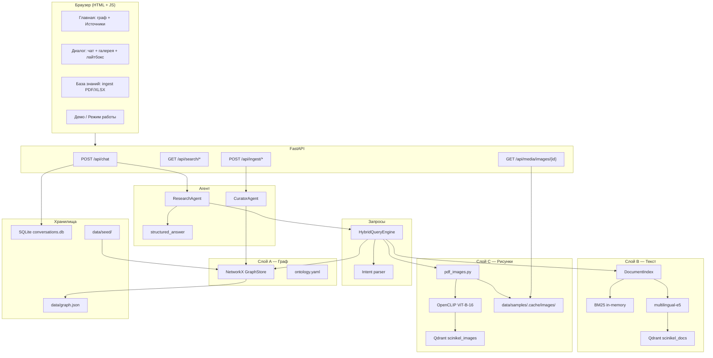

### Роли слоёв

| Слой | Назначение | Источник правды | Когда используется |
|------|------------|-----------------|-------------------|
| **A. Граф** | Эксперименты, material×mode, пробелы, сравнения | `graph.json`, seed XLSX | Основной ответ в чате |
| **B. Текст** | Фрагменты PDF/отчётов, RAG | Qdrant + BM25 | Citations, `document_media` |
| **C. Рисунки** | Графики, таблицы как изображения | CLIP + кэш файлов | GIAB-демо, мультимодальный поиск |

---

## 3. Поток: вопрос пользователя → ответ

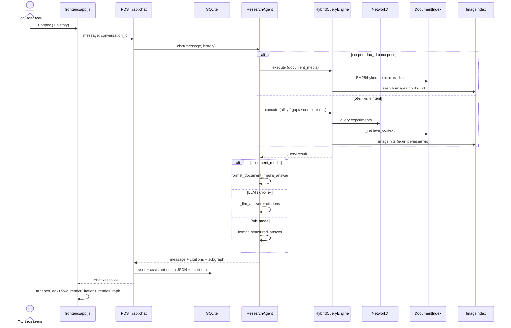

### Ветвление ответа (ResearchAgent)

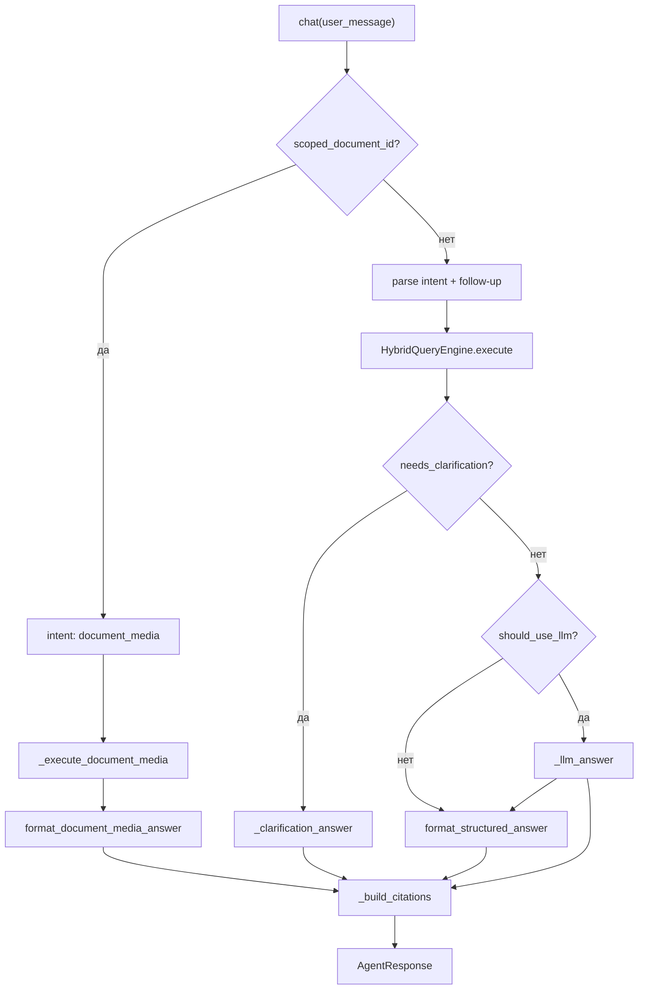

---

## 4. Поток: поиск по документам (слой B)

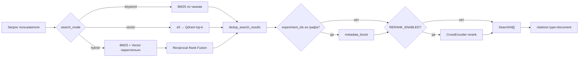

### Чанкинг и индексация текста

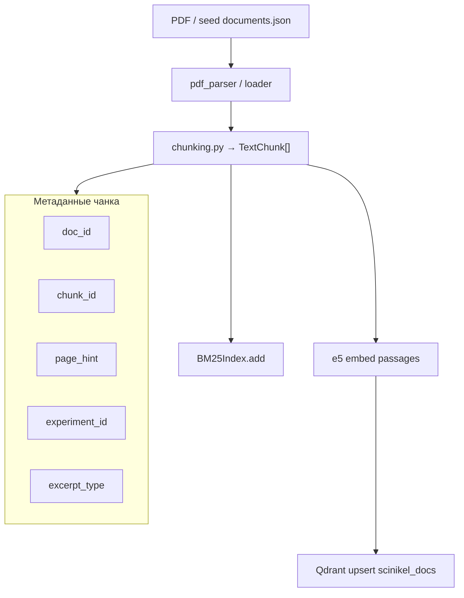

**Режимы** (`data/llm_runtime.json`):

| `search_mode` | Активные backend'ы |
|---------------|-------------------|
| `keyword` | BM25 |
| `vector` | Qdrant + e5 |
| `hybrid` | BM25 + Qdrant + RRF |

---

## 5. Поток: мультимодальный поиск (слой C)

### Ingest PDF → индекс рисунков

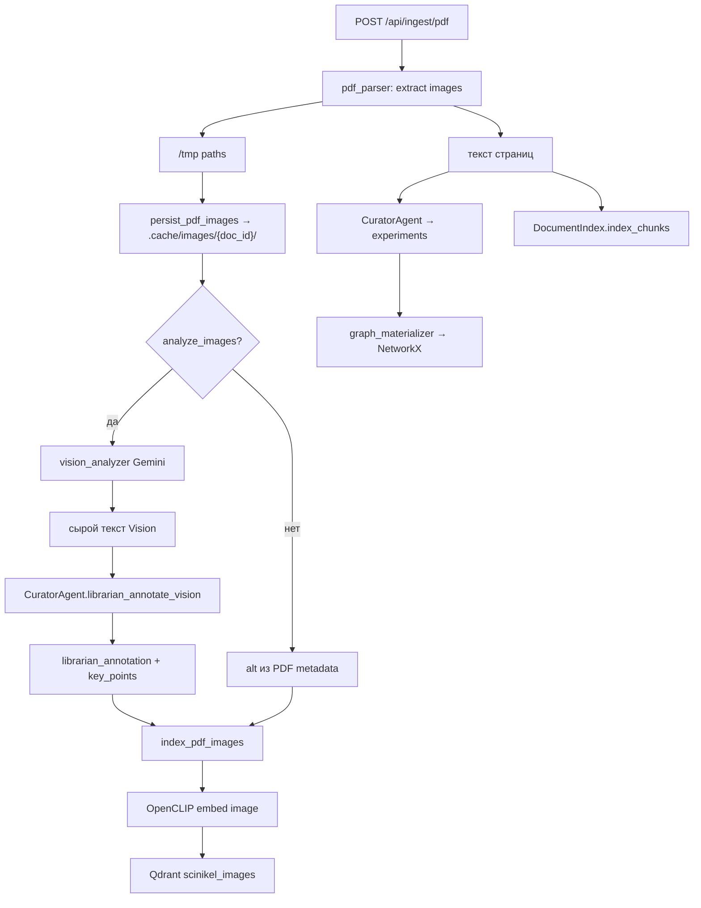

### Запрос `document_media` (GIAB-демо)

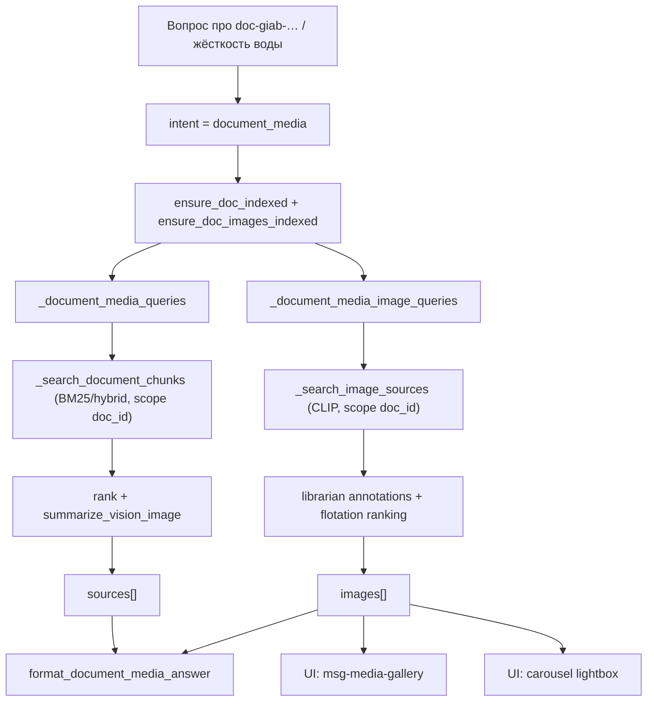

### Отдача рисунка в UI

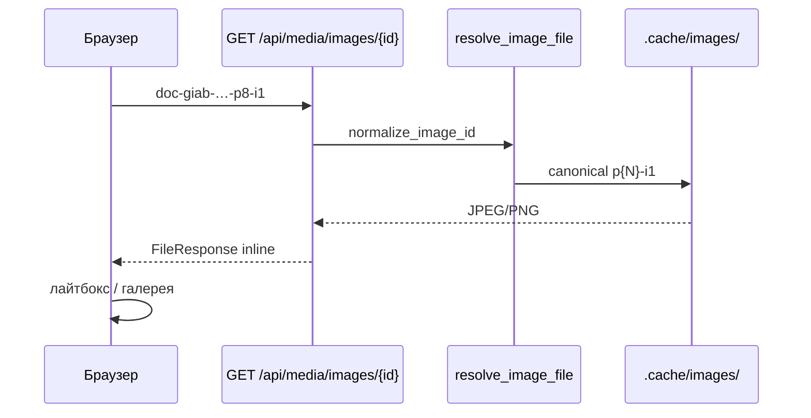

---

## 6. Поток: ingest и наполнение графа

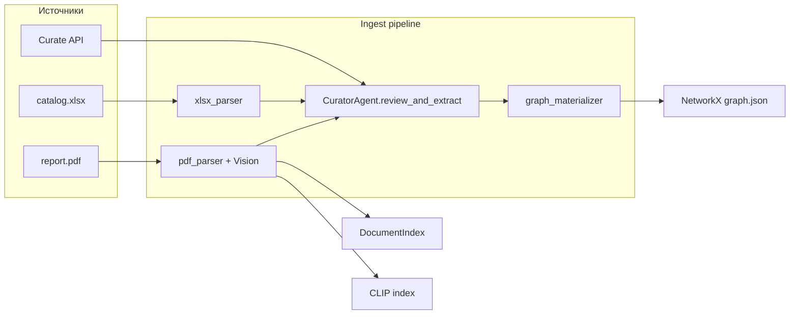

---

## 7. Поток: UI и сохранение контекста

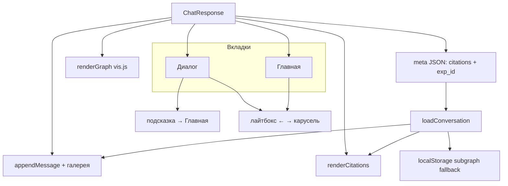

---

## 8. Компоненты и файлы

| Компонент | Путь |
|-----------|------|
| API, lifespan, media | `src/scinikel/api/app.py` |
| Диалоговый агент | `src/scinikel/agent/assistant.py` |
| Формат ответов PDF/таблиц | `src/scinikel/agent/structured_answer.py` |
| Куратор + librarian Vision | `src/scinikel/agent/curator.py` |
| Intent + graph + document_media | `src/scinikel/query/engine.py` |
| Индекс текста | `src/scinikel/search/index.py` |
| BM25, chunking, RRF | `search/bm25.py`, `chunking.py`, `fusion.py` |
| CLIP + кэш рисунков | `search/pdf_images.py`, `image_embeddings.py` |
| Qdrant | `search/vector_db.py` |
| Режимы lite/local/full | `services/llm_runtime.py` |
| Диалоги SQLite | `storage/conversations.py` |
| UI | `frontend/static/app.js`, `index.html` |

---

## 9. Внешние зависимости

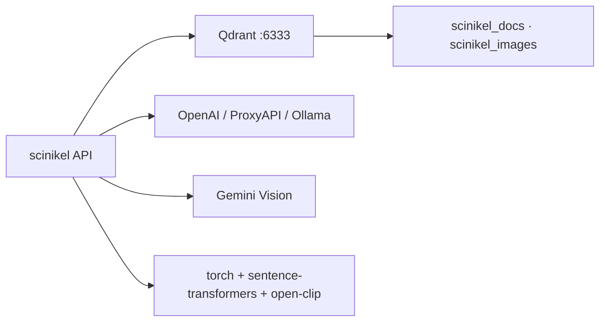

| Сервис | Назначение | Обязательность |
|--------|------------|----------------|
| Qdrant | Векторный поиск текста и рисунков | full / multimodal |
| LLM | Ответы и Curator ingest | local / full |
| Gemini | Vision при PDF ingest | multimodal |
| torch + e5 + CLIP | Эмбеддинги | hybrid + images |

---

## 10. Масштабирование (после хакатона)

| Сейчас | Целевое |
|--------|---------|
| NetworkX in-memory | Neo4j + Cypher |
| SQLite диалоги | PostgreSQL / shared store |
| Один процесс API | workers + очередь ingest |
| Локальный Qdrant | репликация, ACL |

---

## 11. Связанные документы

- [KB_BACKOFFICE.md](./KB_BACKOFFICE.md) — бэкофис: ingest, чанки, e5
- [PLAN.md](../PLAN.md) — статус и приоритеты
- [SEARCH_ROADMAP.md](./SEARCH_ROADMAP.md) — этапы 0–6 поиска
- [MULTIMODAL_STATUS.md](./MULTIMODAL_STATUS.md) — GIAB, CLIP, Vision
- [USABILITY.md](./USABILITY.md) — UX и приёмка
- [3DTODAY_PORTING.md](./3DTODAY_PORTING.md) — заимствования из 3dtoday
