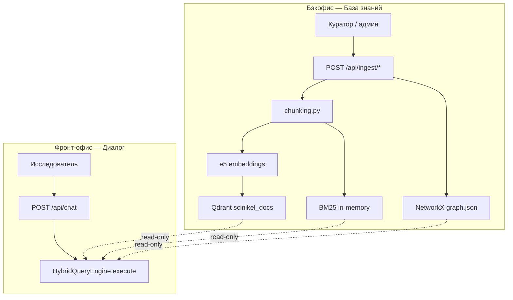
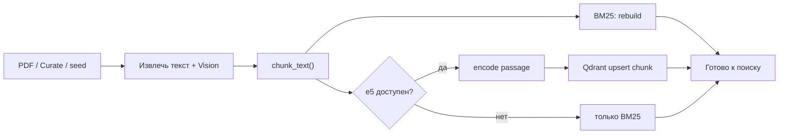

# База знаний — бэкофис (формирование и индексация)

> **Принцип:** индексация чанков (BM25 + e5 → Qdrant) — операция **бэкофиса**, не диалога.  
> Исследователь в чате только **ищет**; куратор/админ в «Базе знаний» **наполняет и переиндексирует** KB.

Связано: [ARCHITECTURE.md](./ARCHITECTURE.md) · [SEARCH_ROADMAP.md](./SEARCH_ROADMAP.md) · [PLAN.md](../PLAN.md)

---

## Два контура



| Контур | Вкладка UI | Что делает | Чего **не** делает |
|--------|------------|------------|-------------------|
| **Фронт-офис** | Диалог, Демо, Главная | Вопрос → граф + поиск + ответ + citations | Не пишет в Qdrant, не чанкует PDF |
| **Бэкофис** | База знаний | Загрузка XLSX/PDF, Curator → граф, **индекс чанков** | Не ведёт диалог с исследователем |

---

## Пайплайн индексации текста (при ingest)

Каждый документ в KB проходит одни и те же шаги — **только в бэкофисе**:



### Что такое чанк

Фрагмент текста (~500–1500 символов) с метаданными:

| Поле | Пример |
|------|--------|
| `doc_id` | `doc-giab-ni-cu-flotation-water` |
| `chunk_id` | `doc-giab-…#c30` |
| `page` | 10 |
| `experiment_id` | `EXP-2024-001` |

### Роль e5 на этом этапе

**e5** (`intfloat/multilingual-e5-base`) вызывается **при записи** чанка в индекс:

```
index_text = title + "\n\n" + chunk_text
vector = e5.encode(index_text)   # 768 чисел
qdrant.upsert(chunk_id, vector, metadata)
```

При **редактировании** документа (повторный ingest, curate с тем же `doc_id`):

1. Старые чанки документа удаляются из памяти (`_remove_doc_chunks`)
2. Текст заново режется на чанки
3. BM25 пересобирается
4. В Qdrant — upsert новых векторов (этап 2: полная замена по `doc_id`)

Диалог **никогда** не вызывает `index_text` — только `search()`.

---

## Точки входа бэкофиса (API)

| Операция | Endpoint | Индекс чанков | Граф | CLIP |
|----------|----------|---------------|------|------|
| PDF отчёт | `POST /api/ingest/pdf` | ✅ `index_text` | ✅ Curator | опционально |
| Текст / curate | `POST /api/ingest/curate` | ✅ | ✅ | — |
| Каталог XLSX | `POST /api/ingest/xlsx` | — | ✅ эксперименты | — |
| Пересборка демо | `POST /api/admin/reload` | ✅ seed + samples | ✅ | фон |

После загрузки PDF на вкладке «База знаний» в сводке ingest отображаются:

- **Текстовых чанков** — сколько фрагментов в BM25
- **Поиск (backend)** — `bm25` / `qdrant+e5+chunks` / `hybrid+rrf`

---

## Когда нужна переиндексация

| Событие | Действие бэкофиса |
|---------|------------------|
| Новый PDF | Ingest → автоматически чанки + e5 |
| Исправлен текст отчёта | Повторный ingest того же `doc_id` |
| Смена `search_mode` на hybrid | Убедиться, что чанки уже в Qdrant; иначе reload / re-ingest |
| Restart API без Qdrant | `rehydrate_doc_from_qdrant` при первом запросе (временный костыль) |
| Материалы организаторов | XLSX → граф; PDF → ingest с Vision + e5 |

**Целевое (этап 2 roadmap):** явная кнопка «Переиндексировать документ» и статус по каждому `doc_id` в UI бэкофиса.

---

## Отличие от индексации рисунков

| | Текстовые чанки | Рисунки (CLIP) |
|---|-----------------|----------------|
| **Когда** | Ingest PDF / curate | Ingest PDF (+ фон при старте API для samples) |
| **Модель** | e5 | OpenCLIP ViT-B-16 |
| **Хранилище** | Qdrant `scinikel_docs` | Qdrant `scinikel_images` + файловый кэш |
| **Контур** | Бэкофис (основной) | Бэкофис; samples — автозагрузка для демо |

Оба индекса **формируются при наполнении KB**, не при вопросе в чате.

---

## Конфигурация e5 для бэкофиса

```bash
./scripts/setup_venv.sh --search --multimodal
# config.env
HF_MODEL_NAME=intfloat/multilingual-e5-base
# data/llm_runtime.json
"search_mode": "hybrid"   # рекомендуется для full
```

```bash
./scripts/services.sh start    # Qdrant обязателен для e5
curl -s http://localhost:8000/api/search/status | python -m json.tool
# ожидаем: "backend": "hybrid+rrf", "giab_chunk_count" > 0
```

---

## Проверка: ingest → поиск (без диалога)

```bash
# Загрузка PDF через бэкофис
curl -F "file=@data/samples/giab-ni-cu-flotation-water.pdf" \
  "http://localhost:8000/api/ingest/pdf?analyze_images=true&index_images=true"

# Статус индекса
curl -s http://localhost:8000/api/search/status

# Прямой поиск по чанкам (read-only, как в диалоге)
curl "http://localhost:8000/api/search/chunks?q=жесткость+воды+флотация&limit=5"
```

---

## Roadmap бэкофиса

| # | Задача | Статус |
|---|--------|--------|
| B1 | Ingest PDF → `index_text` (BM25 + e5) | ✅ |
| B2 | Сводка ingest: число чанков + backend | ✅ |
| B3 | Production: все sample PDF в Qdrant (этап 2) | 🟡 |
| B4 | UI: список документов KB + статус индекса | ✅ |
| B5 | UI: редактирование текста + «Переиндексировать» | ✅ curate + reindex |
| B6 | Удаление doc_id из Qdrant при снятии с публикации | 🟡 purge при reindex |

---

*Обновлено: 2026-06-30*
